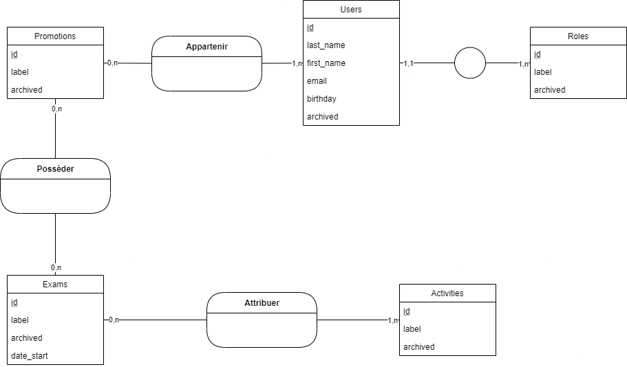

# Resume

Le client souhaite disposer d'une application qui lui permet de saisir en avance un planning sur une journée.
Il veut pouvoir administrer les activités de la journée. Il indique également que ces activités peuvent changer. 
L'application sera à l'usage de personnes qui disposent de plannings communs ou différents selon les cas.

# Backlog

En tant que|Je veux|Afin de|Taches|Priorite
:---|:---|:---|:---|:---
Administrateur|Créer, modifier, desactiver une activité|Gérer les activités possibles|Modele de la table Activite
||||CRUD sur la table
||||Sécuriser le formulaire
Administrateur|Créer, modifier, desactiver un utilisateur|Gérer les utilsateurs|Modele de la table utilisateur
||||CRUD sur la table
||||Sécuriser le formulaire
Administrateur|Affecter une activité à une personne|Visualiser les activités sur une date|Fonction d'ajout de l'id de l'activité à une heure et date
Administrateur|Affecter une activité à un groupe d'activité|Gérer plusieurs sous activités|Fonction d'ajout de l'id de l'activité à un groupe d'activité
Utilisateur|Consulter mes activités à venir|Gérer mon emploi du temps|Mise en place l'api

# TASKS

<a href="https://trello.com/b/eKQXhHHl/app-planning">Lien vers canvas</a>

# MCD

# MPD

roles: id, label, archived;
promotions: id, label, archived;
users: id, last_name, first_name, birthday, email, archived, #role_id;
users_promotions : id, #promotion_id, #user_id, archived;
exams: id, label, date_start, archived;
exams_promotions : id, #exam_id, #promotion_id, archived;
activites: id, label, archived;
exams_activities: id, #exam_id, #activity_id, duration, order, archived;

# Wireframes
<a href="https://www.canva.com/design/DAEle0t-GTM/TqeNjjJlqDOhRNJOl3Hj-w/view?website#1">Lien vers canvas</a>

